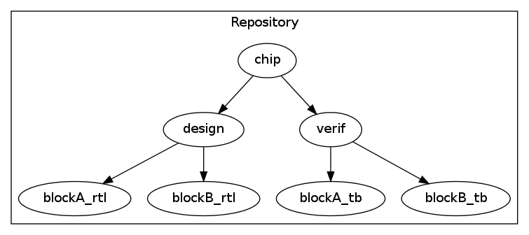
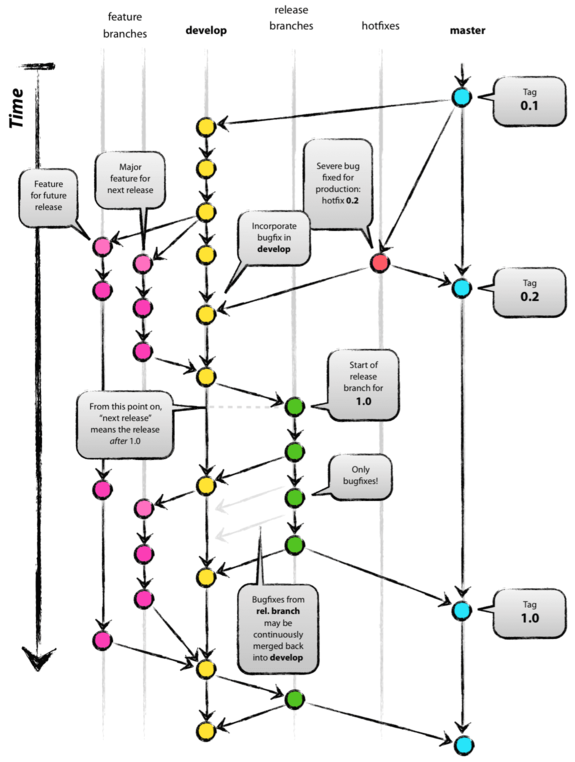
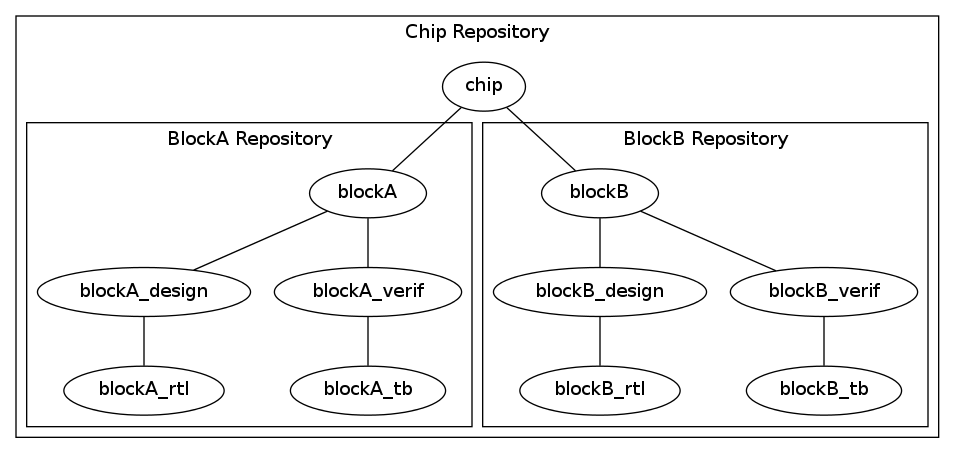

## Git For RTL Designers (Git for Agile Hardware design?)

### Waterflow Model
  * Sequential
  * Each stage finishes before the next one can start.
RTL Design -> Block Level Verification -> Top Level Verification -> Emulation -> BackEnd

### Agile Model
  * Teams work together with maybe slight lag in time.
  * Finish at the same time.
  * Multiple iterations like 90% functional, 100% functional
`
RTL Design -------------> Block Level Verification
            ------------> Top Level Verification
              ----------> Emulation
           -------------> Back End
Hence front end RTL designers needs a state of the art version control system to work efficiently.

### Traditional Version Control System
* Traditionally hardware design repositories are organized as a single monolithic central repository with a single main trunk. 
* Creating branches is slow and generally frowned upon. 
* Tagging is light weight and used for sharing code. This type of model does not meet the current needs of the RTL designers.

### Distributed Version Control System
In this model we propose using a popular distributed version control system "Git". Git is a open source version control system widely used in the software world but has not been adopted widely in the hardware world. 

One major reason is that git is not a evolutionary approach from central version control system. Though it can be bolted on top of a conventional version control system, to reap its benefits, it is best to start with a clean slate. 

Secondly git has lot of features and so would require investment in training and support of existing team. However if these hurdles are overcome we believe that the gains in process improvement will easily justify these startup costs.

### Our Scenario
In this paper we assume a ASIC design environment consisting of many hundred of blocks. The ASIC team consists of many front end RTL designers, verification team involved in block level/chip level/multi chip environments, emulation team working on validating system level tests on an emulation platform and backend team working on synthesis and floor planning. 

### Problems faces by RTL Designers

  * #### No Private Repositories
  RTL designers are working under the pressure of last minute changes. They are constantly working to push the envelope by trying different implementation of the same features looking to either optimize power, timing, area etc.

  2. ####Supporting Multiple Flavors of Design
  * RTL designers are supporting multiple teams at the same time. Traditionally a block level would be verified by the block level team and when complete, would be part of the full chip verificaton. But now, verification teams are running in parallel. The same block could be simultaneously been verified in full chip, multi chip and even emulation environments by different teams.
  * Moreover RTL designers now need to actively work with the backend team to improve synthesis, floor planning for optimizing power, timing....etc. The requirments for fixes here may be different from that required by the verification team. For example the designer might want to flop signals without worrying about the functionality of the design.

3. ####Dependency Hell
  Keeping multiple blocks under one repository causes unwarranted dependencies to creep between the blocks. This leads to "dependency hell" where an unrelated bad check in, causes the current block environment to fail.

4. ####Robust Release Mechanism
  + It is a good practice to always keep the last working version of the design in case a bad checkin requires the design to be reverted back. 
  + Bugs discovered in older releases may need a hot fix in the same release.  

5. ####Automated Testing
  Version control system must provide hooks to run regressions, lint tools etc. Implementing it manually by a "BuildMaster" is time consuming and wasting of resource. 

### How Does Git Solve it ?
1. ####Multiple Repositories 
  * Git is a distributed version control system. It allows designers to have private repositories. Designers can work on their experiments using version control without it being visible to anyone else. At some point if the experiments succeed the code can be made visible to selected or everyone on the team.

2. #### LightWeight Branches
  + Git support light weight branching. Branches allow RTL designers to form dynamic subteams and collaborate on a particular branch without affecting other branches.

  + Switching between branches allows the designer to use the same workspace to work on any of the branches.

  

3. #### Composite Repositories
  Git allows each block to be an independent repository. This requires that the block be organized to be self contained. All external dependencies are explicitly declared by creating a submodule to the external repository. For exampe the chip level repository is a composite repository that pulls in the block repositories.

4. #### Release Branches
  + Though all branches are technically the same for Git, it is a common convention to make the "master" branch as the release branch. A commit on the master branch can be treated as a release and tagged appropriately. Having a dedicated branch provides a history of all the releases and so the user can switch to any of the previous branches 
 
 + A hot fix can be implemented as a branch from the release branch. Once validated this branch can be merged back to the development branch so that the bug fixes propagate to the next new release. 

5. #### Hooks For scripting
  Git provides hooks on different events like commit and push. A push to a particular branch can trigger a continuous integration engine like "Jenkins" to start the regressions on it. Similarly commits may trigger lint and other styling tools to be invoked.
